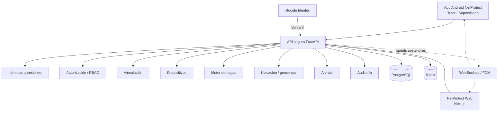

# Diagrama de componentes

En Sprint 1 se implementan los componentes sólidos `Android`, `Web`, `API`, `PostgreSQL` y `Redis`; los demás representan límites previstos, no funcionalidad ya implementada.
