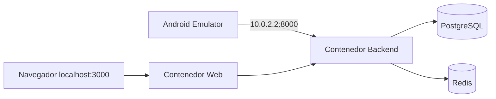
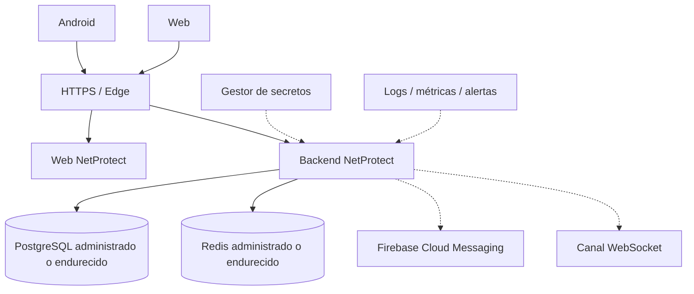

# Diagrama de despliegue

## Desarrollo local

## Producción objetivo

El proveedor cloud y los servicios concretos se definirán en Sprint 26. El diagrama fija responsabilidades, no un proveedor específico.
