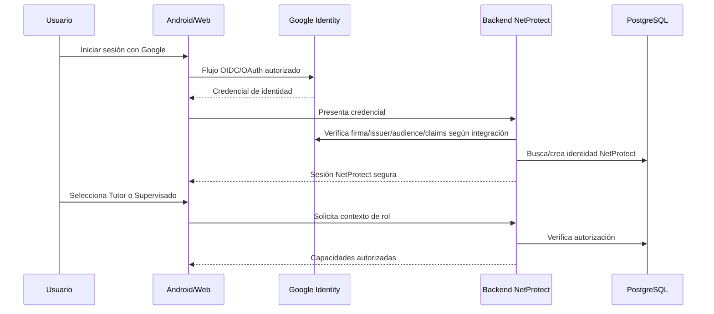

# Flujo de autenticación previsto

> Diseño previo. Se implementará en Sprint 3.

```mermaid
sequenceDiagram
    participant U as Usuario
    participant C as Android/Web
    participant G as Google Identity
    participant B as Backend NetProtect
    participant P as PostgreSQL

    U->>C: Iniciar sesión con Google
    C->>G: Flujo OIDC/OAuth autorizado
    G-->>C: Credencial de identidad
    C->>B: Presenta credencial
    B->>G: Verifica firma/issuer/audience/claims según integración
    B->>P: Busca/crea identidad NetProtect
    B-->>C: Sesión NetProtect segura
    U->>C: Selecciona Tutor o Supervisado
    C->>B: Solicita contexto de rol
    B->>P: Verifica autorización
    B-->>C: Capacidades autorizadas
```

Regla: elegir visualmente “Tutor” no concede privilegios. El backend decide la autorización efectiva.
