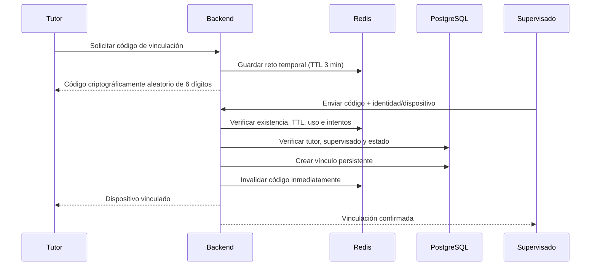

# Flujo de vinculación previsto

> Diseño previo. Se implementará en Sprint 5.

```mermaid
sequenceDiagram
    participant T as Tutor
    participant B as Backend
    participant R as Redis
    participant P as PostgreSQL
    participant S as Supervisado

    T->>B: Solicitar código de vinculación
    B->>R: Guardar reto temporal (TTL 3 min)
    B-->>T: Código criptográficamente aleatorio de 6 dígitos
    S->>B: Enviar código + identidad/dispositivo
    B->>R: Verificar existencia, TTL, uso e intentos
    B->>P: Verificar tutor, supervisado y estado
    B->>P: Crear vínculo persistente
    B->>R: Invalidar código inmediatamente
    B-->>T: Dispositivo vinculado
    B-->>S: Vinculación confirmada
```

El diseño exige uso único, expiración de 3 minutos, protección frente a fuerza bruta y auditoría.
