# Modelo de datos conceptual

> Este ER es un artefacto de arquitectura. Las migraciones y restricciones definitivas pertenecen al Sprint 2.

```mermaid
erDiagram
    USERS ||--o{ USER_ROLES : has
    ROLES ||--o{ USER_ROLES : grants
    USERS ||--o{ TUTOR_DEVICES : tutors
    DEVICES ||--o{ TUTOR_DEVICES : linked
    USERS ||--o{ PAIRING_CODES : creates
    DEVICES ||--o{ APPLICATIONS : reports
    DEVICES ||--o{ APPLICATION_RULES : receives
    DEVICES ||--o{ WEB_RULES : receives
    CATEGORIES ||--o{ CATEGORY_RULES : groups
    DEVICES ||--o{ TIME_RULES : receives
    DEVICES ||--o{ USAGE_EVENTS : emits
    DEVICES ||--o{ WEB_EVENTS : emits
    DEVICES ||--o{ LOCATIONS : reports
    DEVICES ||--o{ GEOFENCES : monitors
    GEOFENCES ||--o{ GEOFENCE_EVENTS : emits
    DEVICES ||--o{ ALERTS : generates
    USERS ||--o{ AUDIT_LOGS : acts
    USERS ||--o{ SESSIONS : owns
    DEVICES ||--o{ SYNC_EVENTS : synchronizes
    DEVICES ||--o{ SECURITY_EVENTS : emits
    DEVICES ||--o{ NOTIFICATIONS : reports
    DEVICES ||--|| DEVICE_STATUS : has
```

Entidades previstas: `users`, `roles`, `user_roles`, `devices`, `tutor_devices`, `pairing_codes`, `applications`, `application_rules`, `web_rules`, `categories`, `category_rules`, `time_rules`, `usage_events`, `web_events`, `locations`, `geofences`, `geofence_events`, `alerts`, `audit_logs`, `sessions`, `sync_events`, `security_events`, `notifications`, `device_status`.
